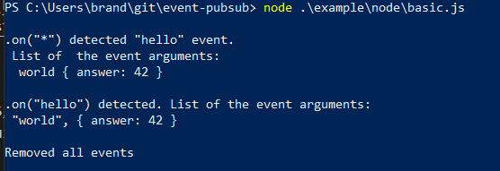
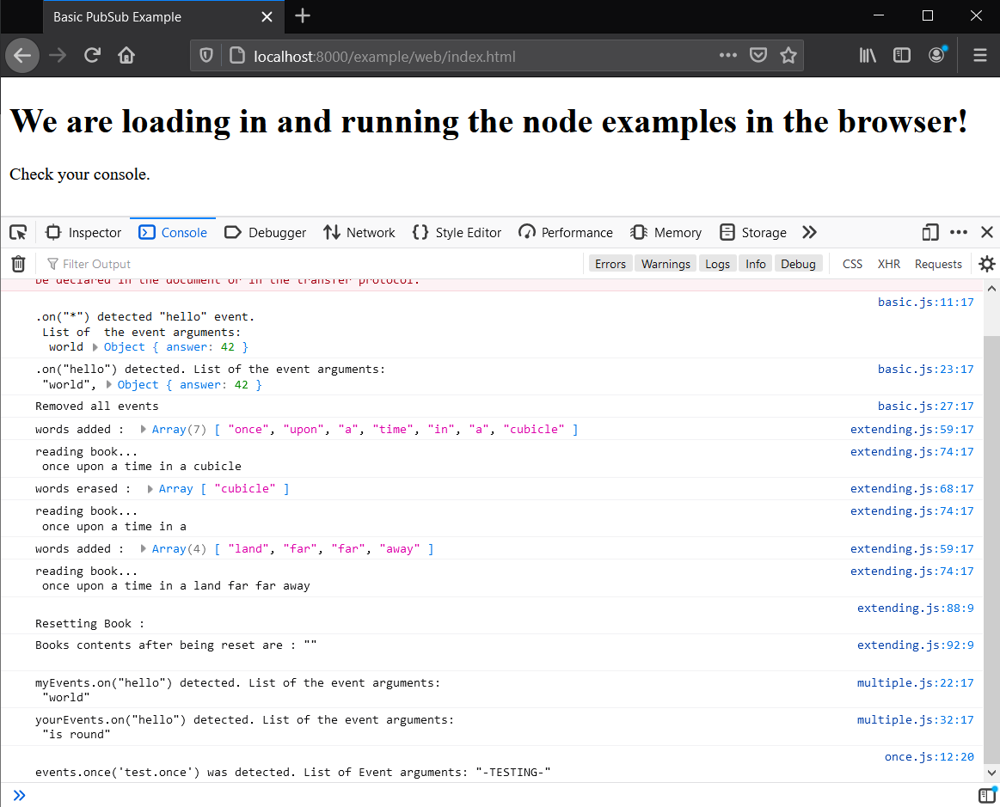

# Event PubSub

`npm install event-pubsub`

npm info :  [See npm trends and stats for event-pubsub](http://npm-stat.com/charts.html?package=event-pubsub&author=&from=&to=)   

  

GitHub info :  
  

***Super light and fast*** Extensible ES6+ event system for Node and the browser the same files that work in node will work in the browser without any modifications. If you must support old browsers you can transpile the module.

**EXAMPLE FILES**  

1. [Node Event PubSub Examples](https://github.com/RIAEvangelist/event-pubsub/tree/master/examples/node)  

`node ./example/node/basic.js`  
`node ./example/node/miltiple.js`  
`node ./example/node/extending.js`  
`node ./example/node/once.js`  




2. [Browser Event PubSub Examples](https://github.com/RIAEvangelist/event-pubsub/tree/master/examples/browser)

You will notice in the browser console that we are running the exact same files from node above, in the browser!

To run the browser tests, first start the example `node-http-server` by running `npm start`. Then go to the [example page](http://localhost:8000/example/web/index.html): http://localhost:8000/example/web/index.html and check out the console. Provided your router and firewall are not blocking your IP/ports, you can go to `http://[your-ip-here]:8000/example/web/index.html` on your mobile device to check the page out as well provided it is on the same network.

#### Chrome


#### Edge


#### FireFox Nightly
As of 11/21/2020 you need to set the javascript private fields and methods flags to `true`. 


 

### Browser Script 


```html

<script type="module" src='./node_modules/event-pubsub/index.js'></script>

```

### Node & Browser import

Importing with relative paths will make sure your code will work both with node and the browser without transpiling where supported.

```js

import EventPubSub from './node_modules/event-pubsub/index.js';

events=new EventPubSub

```

# Methods

|Method|Arguments|Description|
|------|---------|-----------|
|on|type:`string`, handler:`function`, once:`boolean`|will bind the `handler` function to the the `type` event. Just like `addEventListener` in the browser. If once is set to true the hander will be removed after being called once.|
|once|type:`string`, handler:`function`| will bind the `handler` function to the the `type` event and unbind it after ***one*** execution. Just like `addEventListener` in the browser withe the `once` option set|
|off|type/`*`:`string`, handler/`*`:`function`|will ***un***bind the `handler` function from the the `type` event. If the `handler` is `*`, all handlers for the event type will be removed.   Just like `removeEventListener` in the browser, but also can remove all event handlers for the type.|
|emit|type:`string`, `...data` arguments|will call all `handler` functions bound to the `*` event and the `type` event. It will pass all `...data arguments` to those handlers, for `*` events, the first arg will be the `type` you can filter the events|
|reset||Removes all events of any and all types including `*`|

# Members

|Member|Type|Description|
|------|----|-----------|
|.list |Object|List representation of all the bound events, primarily used for visibility. |

# The ` * ` event type

The ` * ` event type will be triggered by ***any `emit`***. These also run first. The handlers for `*` should expect the first arg to be the `type` and all args after that to be data arguments.


## Basic Examples


```javascript

//relative paths will let your code work in both node and the browser!
import EventPubSub from './node_modules/event-pubsub/index.js';

events=new EventPubSub

events.on(
    'hello',
    (data)=>{
        console.log('hello event recieved ', data);
    }
);

events.emit(
    'hello',
    'world'
);

```

#### Basic Chaining

```javascript

events.on(
    'hello',
    someFunction
).on(
    'goodbye',
    anotherFunction
).emit(
    'hello',
    'world'
);

events.emit(
    'goodbye',
    'humans'
).off(
    'hello',
    '*'
);

```

### Basic Event Emitter and/or Extending Event PubSub

```javascript
//relative paths will let your code work in both node and the browser!
import EventPubSub from './node_modules/event-pubsub/index.js';


class Book extends EventPubSub{
    constructor(){
        super();
        //now Book has .on, .off, and .emit

        this.words=[];
    }

    add(...words){
        this.words.push(...words);
        this.emit(
            'added',
            ...words
        );
    }

    read(){
        this.emit(
            'reading'
        );
        console.log(this.words.join(' '));
    }
}

const book=new Book;

book.on(
    'added',
    function(...words){
        console.log('words added : ',words);
        this.read();
    }
);

book.add(
    'once','upon','a','time','in','a','cubicle'
);


```

